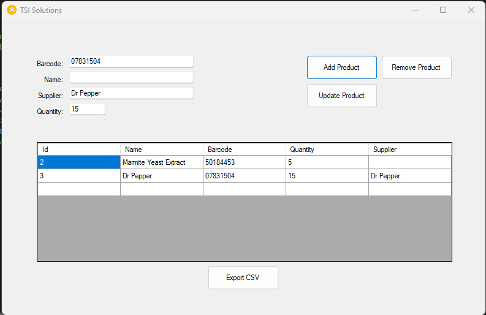
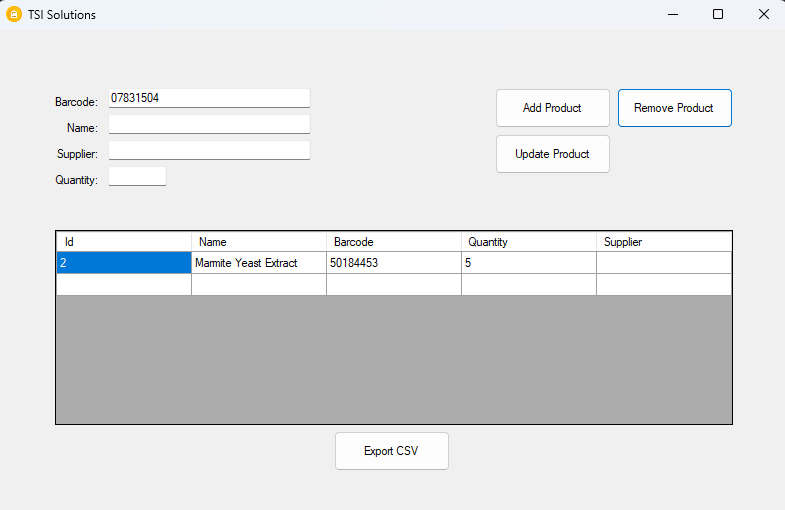
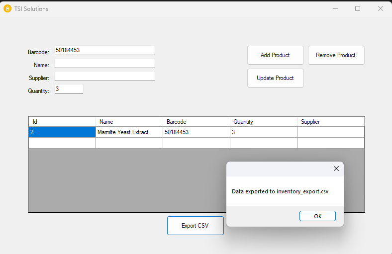

# Inventory Management System

## Project Description
This is an efficient, technology-driven Inventory Management System designed for businesses that require optimized inventory tracking and operations. The project was inspired by logistics experience using the SAP system and focuses on simplicity and efficiency.

## Features
- Real-time product lookup using OpenFoodFacts API.
- User-friendly C# WinForms GUI.
- SQLite database for product data storage.
- Core functionalities include adding, removing, and updating products.
- CSV export functionality for inventory data.
- Scalable for various business sizes.

## Technology Stack
- Programming Language: C#
- GUI: WinForms (Windows Forms)
- Database: SQLite
- API: OpenFoodFacts API
- JSON Parsing: Newtonsoft.JSON

## Installation Instructions
1. Clone the repository:
   ```bash
   git clone https://github.com/vtkach23/Inventory_Management_System
   ```
2. Open the solution file (.sln) in Visual Studio.
3. Build the project to install dependencies (SQLite, Newtonsoft.JSON).
4. Run the application.

## Usage Instructions
- Use the "Add" button to insert new products into the inventory.
- Use the "Remove" button to delete a product.
- Use the "Update" button to modify the quantity of an existing product.
- Use the "Export" button to save the inventory data as a CSV file.

## Screenshots
### Adding a Product


### Removing a Product


### Updating Product Quantity


### Exporting CSV


## Future Improvements
- Add user authentication.
- Improve UI design for a more modern look.
- Integrate more APIs for enhanced product lookup.
